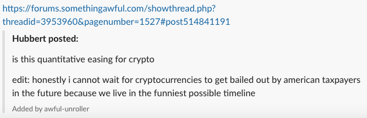

# Something Awful Slack Unroller

This is a little tool that will take links to specific somethingawful posts, and present them to
Slack in a nice preview.

## Current Snapshot of Functionality

Right now, it is only able to display text.

## Shortcomings:

* Doesn't handle emoji, omits them and breaks the text into a new line instead
* Ignores images
* Omits links
* Does nothing with quotes

## Deployment:

There is a systemd service file in `infra/` but I have not checked in the secrets. A fat, executable
jar can be built with `./gradlew bootJar`, and then that executable needs to be deployed somewhere
that Slack can be pointed to it through the slack app integration.

